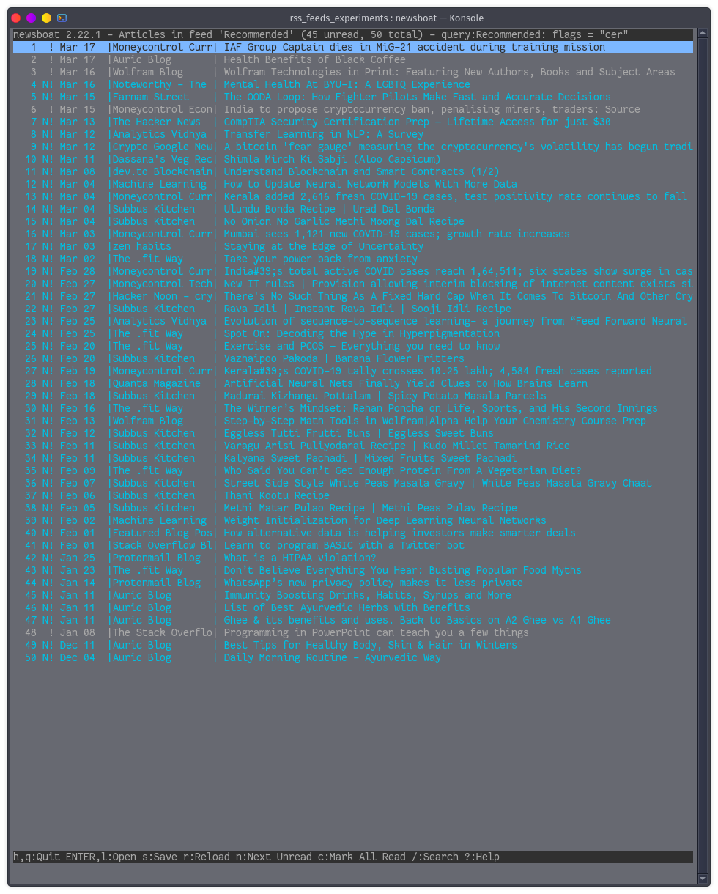

# newsboat-recommender
Enjoy RSS feeds on newsboat with machine learning recommendations based on your interest!

# Instructions:
	1. Setup a virtual environment and install numpy and sklearn
	2. in newsboat, use ctrl+e to set a flag and over the time, set the flag to s for those articles which pique your interest 
	3. Once you have collected 200-300 articles suited to your interest, run python recommend.py ~/.newsboat/cache.db (or any db file you use actively)
	4. In your newsboat URL file, set up a query feed to filter the flags 'cer'. In this filter, your recommended
	   articles will pop up as unread.

### Query Feed Setup

### Twitter RSS feed recommendation Generation

### End Result

### Thanks
Thanks to https://github.com/karpathy/arxiv-sanity-preserver. Most of the logic was taken from here.

## Extra Info
Use the BERT based branch if you want to use transformer models in your recommendations
