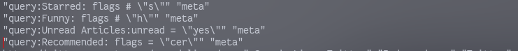

# newsboat-recommender
Enjoy RSS feeds on newsboat with machine learning recommendations based on your interest!

# Instructions:
	1. Setup a virtual environment and install numpy and sklearn and sentence-transformers
	2. in newsboat, use ctrl+e to set a flag and over the time, set the flag to s for those articles which pique your interest 
	3. Once you have collected 200-300 articles suited to your interest, run python learn_preferences.py ~/.newsboat/cache.db (or any db file you use actively). This is a time consuming process if you have lots of articles in your database.
	4. In your newsboat URL file, set up a query feed to filter the flags 'cer'. In this filter, your recommended
	   articles will pop up as unread.
	5. Once this is done, you can run generate_recommendations.py ~/.newsboat/cache.db to update your database with the recommendations.
	6. Then your recommendations will be in the filter set up in 4)

### Query Feed Setup

### Twitter RSS feed recommendation Generation

### Thanks
Thanks to https://github.com/karpathy/arxiv-sanity-preserver. Most of the logic was taken from here.
